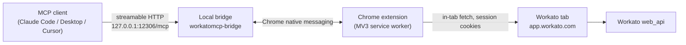

<div align="center">


# WorkatoMCP

**An MCP server that gives AI agents typed, first-class access to your Workato workspace — through the browser session you are already signed in to.**

[](LICENSE)
[](https://www.npmjs.com/package/workatomcp-bridge)
[](https://nodejs.org)
[](https://modelcontextprotocol.io)

[Quick start](#quick-start) · [Tool reference](docs/TOOLS.md) · [Architecture](docs/ARCHITECTURE.md) · [Security model](SECURITY.md) · [Troubleshooting](docs/TROUBLESHOOTING.md)

</div>

---

## What it is

WorkatoMCP is a Chrome extension plus a local MCP bridge. It exposes **66 Workato tools** — recipes, jobs, connections, folders and projects, lookup tables, data tables, and the recipe editor itself — to any MCP client (Claude Code, Claude Desktop, Cursor, and others).

Instead of asking you to mint API tokens, it borrows the authenticated Workato session already open in your browser. Every request goes out from a real Workato tab, with your cookies, your CSRF token, your permissions, and your environment. Nothing is stored, and nothing leaves the machine.

That makes an agent able to do the things a Workato developer actually spends the day on:

```
"Recipe 67992145 has been failing since this morning — find out why and fix it."

→ workato_list_jobs(recipe_id: 67992145, status: "failed")
→ workato_job_trace(recipe_id: 67992145, job_id: 8412…, lines: [104, 118])
→ workato_pull_recipe(recipe_id: 67992145, step: "1616311d")
→ workato_recipe_set_input_path(recipe_id: …, path: "records.custbody_status.refName", value: …)
→ workato_recipe_status(recipe_id: 67992145)   # verify the write landed
```

## Why a browser extension

Workato's public Developer API covers a fraction of what the web app can do — there is no public endpoint for the recipe code tree, job traces, lookup-table CRUD, data tables, or the connector test-action runner. All of it exists behind the same `web_api` endpoints the UI calls.

Piggybacking on the browser session gets you:

- **No API tokens.** Nothing to provision, rotate, leak, or commit.
- **Your exact permissions.** The agent can do what you can do — no more.
- **Multi-region and multi-workspace out of the box.** `app.workato.com`, `app.eu.workato.com`, `*.workato.is`, and custom tenants all work; `workato_switch_profile` moves between Chrome profiles.
- **Read/write parity with the UI.** If you can click it, a tool can usually do it.

## How it works



The bridge is a local Fastify server on `127.0.0.1:12306`. It is launched by Chrome through native messaging on the first tool call — you never start it manually. The extension resolves a signed-in Workato tab, runs the request inside that tab's origin, and returns a slimmed, agent-friendly payload.

See [docs/ARCHITECTURE.md](docs/ARCHITECTURE.md) for the full request path, tab resolution rules, and timeout behaviour.

## Highlights

|                                  |                                                                                                                                                                                                                 |
| -------------------------------- | --------------------------------------------------------------------------------------------------------------------------------------------------------------------------------------------------------------- |
| **Recipe round-trip**            | Pull the code tree in four views (`full`, `compact`, `outline`, `step`), edit it, push it back with an optimistic version lock. Large recipes stream through a file path so they never hit the model's context. |
| **Surgical edits**               | Set a nested input path, map a datapill, replace a Python step's code, or rewrite an extended schema — without downloading the whole tree.                                                                      |
| **Job forensics**                | Per-step traces with schema noise stripped, line ranges, error summaries, cursor-paginated job lists, and job re-runs by master job id.                                                                         |
| **Any SaaS behind a connection** | `workato_run_query` speaks SOQL, SuiteQL, and SQL through your existing connections. `workato_call_action` invokes any connector action — behind a write-safety gate.                                           |
| **Tables**                       | Full CRUD for both Lookup Tables (11 tools, incl. CSV bulk import) and the newer relational Data Tables (12 tools).                                                                                             |
| **Workspace management**         | Project and folder trees, create/rename/move/delete, and recipe relocation.                                                                                                                                     |
| **Write safety**                 | Mutating connector actions are refused unless the caller passes `allow_writes: true`. Connection secrets are stripped on every path.                                                                            |
| **Recipe authoring skill**       | A companion [Claude Code skill](#companion-skill) documents Workato's code-tree JSON and its Ruby-allowlist formula language.                                                                                   |

WorkatoMCP also inherits ~32 general browser-automation tools from its upstream project (navigation, snapshots, DOM interaction, network capture, screenshots, console). They are useful when a Workato flow needs UI driving that no endpoint covers.

## Quick start

### Prerequisites

- Node.js 20+
- pnpm 8+
- Google Chrome or Chromium
- A Workato account you can sign into in that browser

### 1. Build the extension

```bash
git clone https://github.com/Eithery-rc/WorkatoMCP
cd WorkatoMCP
pnpm install
pnpm build:shared
pnpm build:extension
```

The unpacked extension lands in `app/chrome-extension/dist/chrome-mv3`.

The extension's public RSA key is pinned in `app/chrome-extension/wxt.config.ts`, so every clone builds to the same deterministic extension ID — `bpjpdgkeelhkijkllcmogemkmndgeana` — which is what the bridge's native-messaging allowlist expects.

### 2. Load it in Chrome

1. Open `chrome://extensions/`
2. Enable **Developer mode**
3. **Load unpacked** → select `app/chrome-extension/dist/chrome-mv3`
4. Confirm the ID reads `bpjpdgkeelhkijkllcmogemkmndgeana`

If Chrome shows a different ID, delete `app/chrome-extension/dist/` and `app/chrome-extension/.wxt/`, then rebuild — and check that `CHROME_EXTENSION_KEY` isn't overriding the pinned key.

### 3. Install the bridge

```bash
npm install -g workatomcp-bridge
```

Postinstall registers the native-messaging host for detected browsers. To verify:

```bash
workatomcp-bridge doctor        # diagnose
workatomcp-bridge doctor --fix  # repair registration
```

### 4. Point your MCP client at it

**Claude Code**

```bash
claude mcp add --transport http workato http://127.0.0.1:12306/mcp
```

**Claude Desktop** (and other clients that spawn a command)

```json
{
  "mcpServers": {
    "workato": {
      "command": "npx",
      "args": ["mcp-remote", "http://127.0.0.1:12306/mcp", "--allow-http"]
    }
  }
}
```

**Clients with native streamable-HTTP support**

```json
{
  "mcpServers": {
    "workato": {
      "transport": "http",
      "url": "http://127.0.0.1:12306/mcp"
    }
  }
}
```

Restart the client after editing its config.

### 5. Use it

Open Workato in Chrome, sign in, leave the tab open, and call a tool. The bridge auto-launches on the first request. If a tool returns `WorkatoTabNotFound`, that tab is what's missing.

## Tools

66 Workato tools. Full signatures, parameters, and response shapes are in **[docs/TOOLS.md](docs/TOOLS.md)**.

| Family                                                             | Count | Prefix                | What it covers                                                                  |
| ------------------------------------------------------------------ | ----: | --------------------- | ------------------------------------------------------------------------------- |
| [Recipes & versions](docs/TOOLS.md#recipes--versions)              |     7 | `workato_`            | Pull the code tree, rename, start/stop, status, version diff, version comments  |
| [Jobs](docs/TOOLS.md#jobs)                                         |     3 | `workato_`            | List jobs, per-step traces, re-run by master job id                             |
| [Search & connections](docs/TOOLS.md#search--connections)          |     3 | `workato_`            | Find recipes and connections, inspect a connection (secrets stripped)           |
| [Connector execution](docs/TOOLS.md#connector-execution)           |     2 | `workato_`            | SOQL/SuiteQL/SQL queries and the gated universal action runner                  |
| [Projects & folders](docs/TOOLS.md#projects--folders)              |     7 | `workato_`            | Folder tree, folder CRUD, move recipe, project create/update                    |
| [Code-side recipe editing](docs/TOOLS.md#code-side-recipe-editing) |     7 | `workato_recipe_`     | Add a step, set nested inputs, map datapills, Python code, extended schemas     |
| [Recipe editor UI](docs/TOOLS.md#recipe-editor-ui)                 |    11 | `workato_ui_`         | Drive the live editor: open, edit mode, fields, datapills, save, save code tree |
| [Lookup tables](docs/TOOLS.md#lookup-tables)                       |    11 | `workato_lookup_`     | Table + row CRUD, search, CSV bulk import                                       |
| [Data tables](docs/TOOLS.md#data-tables)                           |    12 | `workato_data_table_` | Table, column, and record CRUD                                                  |
| [Session](docs/TOOLS.md#session)                                   |     3 | `workato_`            | `whoami`, list Chrome profiles, switch profile                                  |

Plus the inherited [browser tools](docs/TOOLS.md#inherited-browser-tools) (`chrome_*`, `get_windows_and_tabs`, `performance_*`).

## Safety model

WorkatoMCP acts with your Workato identity, so the guardrails matter. In short:

- **Write gate.** `workato_call_action` refuses anything that isn't read-shaped unless the caller explicitly passes `allow_writes: true`.
- **Secret stripping.** Connection configs have secret-shaped keys removed on every response path, including `full: true`.
- **No credential storage.** No tokens, no cookies, no session material is persisted or transmitted anywhere but the local bridge.
- **Local-only surface.** The bridge binds to `127.0.0.1`.
- **Optimistic locking.** Recipe writes can pin `expected_base_version_no` so concurrent edits fail loudly instead of being overwritten.
- **Write verification.** Writes that time out are verified by re-reading state rather than blindly retried.

Full details, threat model, and reporting instructions: [SECURITY.md](SECURITY.md).

## Companion skill

`skills/workato-recipes/` is a Claude Code skill documenting Workato's recipe code-tree JSON (triggers, `foreach`/`if`/`repeat`/`try-catch`, Variables by Workato, app actions) and the complete Ruby-allowlist formula language. It pairs with the `workato_*` tools — the tools mutate the tree, the skill explains what's valid inside it.

Install it as a plugin from this repo's marketplace manifest:

```bash
/plugin marketplace add Eithery-rc/WorkatoMCP
/plugin install workato-recipes@workato-mcp
```

## Repository layout

```text
WorkatoMCP/
├── app/
│   ├── chrome-extension/               # MV3 extension (WXT + Vue 3)
│   │   └── entrypoints/background/tools/
│   │       ├── workato/                # recipes, jobs, connections, folders
│   │       ├── workato-recipe/         # code-side mutators
│   │       ├── workato-ui/             # live editor automation
│   │       ├── workato-lookup/         # lookup tables
│   │       ├── workato-data-table/     # data tables
│   │       ├── workato-session/        # whoami
│   │       └── browser/                # inherited browser automation
│   └── native-server/                  # local bridge on 127.0.0.1:12306
├── packages/
│   └── shared/                         # TOOL_NAMES + TOOL_SCHEMAS (source of truth)
├── skills/workato-recipes/             # recipe authoring reference skill
└── docs/                               # tool reference, architecture, design notes
```

## Development

```bash
pnpm install
pnpm build          # shared → bridge → extension
pnpm dev            # watch mode across packages
pnpm typecheck      # tsc --noEmit everywhere (see Known debt below)
pnpm lint           # eslint
pnpm format         # prettier
```

Adding a tool means touching two places: the schema in `packages/shared/src/tools.ts` and the handler under `app/chrome-extension/entrypoints/background/tools/`. Rebuild `shared` before the extension, then reload the unpacked extension and restart the MCP client so the new schema is picked up.

**Known debt:** `pnpm typecheck` reports around 100 errors, all in code inherited from the upstream project (`record-replay-v3`, `element-marker`, `gif-recorder`). None are in the Workato tool families, and the build is unaffected. CI gates on the bridge and shared schemas and reports the extension separately — details in [docs/ROADMAP.md](docs/ROADMAP.md#known-debt).

See [CONTRIBUTING.md](CONTRIBUTING.md) for conventions and [docs/ROADMAP.md](docs/ROADMAP.md) for what's planned.

## Compatibility

|                 |                                                                                              |
| --------------- | -------------------------------------------------------------------------------------------- |
| Browsers        | Chrome / Chromium (MV3). Firefox builds exist upstream but Workato tools are untested there. |
| Platforms       | Windows, macOS, Linux                                                                        |
| Workato regions | US, EU, JP, SG, AU (`*.workato.com`), plus `*.workato.is` and custom tenants                 |
| MCP transports  | Streamable HTTP (`/mcp`), legacy SSE (`/sse` + `/messages`), stdio (`workatomcp-stdio`)      |

## Credits and license

WorkatoMCP is a fork of [hangwin/mcp-chrome](https://github.com/hangwin/mcp-chrome), which provides the extension shell, native-messaging bridge, and browser-automation toolkit. The Workato tool families, session model, and safety gates are this fork's own work.

MIT — see [LICENSE](LICENSE) for this fork and [LICENSE.upstream](LICENSE.upstream) for the parent project.

Workato is a trademark of Workato, Inc. This project is not affiliated with or endorsed by Workato.
