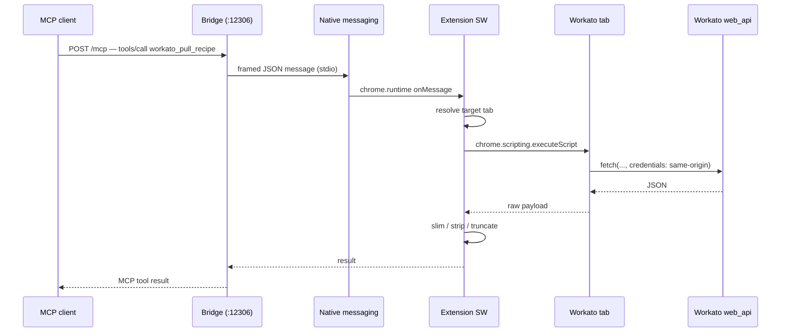

# Architecture

How a tool call travels from an MCP client to Workato and back.

## Components

| Component            | Package                                           | Role                                                                                                                                  |
| -------------------- | ------------------------------------------------- | ------------------------------------------------------------------------------------------------------------------------------------- |
| **Local bridge**     | `app/native-server` → npm `workatomcp-bridge`     | Fastify server on `127.0.0.1:12306`. Terminates MCP transports, forwards tool calls to the extension, serves local file reads/writes. |
| **Chrome extension** | `app/chrome-extension` → npm-less, built with WXT | MV3 service worker. Owns every tool handler, resolves the Workato tab, executes in-tab fetches, slims responses.                      |
| **Shared schemas**   | `packages/shared` → npm `workatomcp-shared`       | `TOOL_NAMES` and `TOOL_SCHEMAS` — one source of truth consumed by both sides.                                                         |
| **Recipe skill**     | `skills/workato-recipes`                          | Documentation-only companion for recipe authoring. Not part of the runtime.                                                           |

## Request lifecycle



1. **Transport.** The bridge exposes streamable HTTP at `POST/GET/DELETE /mcp`, legacy SSE at `GET /sse` + `POST /messages`, and a stdio binary (`workatomcp-stdio`) for clients that require a spawned process. `GET /ping` is a liveness check.
2. **Bootstrap.** The bridge is not started by hand. Chrome launches it through native messaging when the extension first needs it; the extension tells the host which port to listen on.
3. **Dispatch.** The native-messaging host frames requests over stdio (4-byte little-endian length prefix, 16 MB cap) and correlates responses by UUID.
4. **Execution.** Every Workato tool runs _inside a Workato tab_ via `chrome.scripting.executeScript`, so requests carry the session cookies and the CSRF token read from the `XSRF-TOKEN-V2` cookie. No credentials ever cross a process boundary.
5. **Slimming.** Handlers reshape Workato's verbose payloads before returning: schema blocks removed, datapill references shortened, long values truncated, secret-shaped keys stripped. `full: true` opts out where it makes sense.

## Tab resolution

`findWorkatoTab()` in [`workato/tab-dispatch.ts`](../app/chrome-extension/entrypoints/background/tools/workato/tab-dispatch.ts) is the single gatekeeper. It resolves, in order:

1. An explicit `tabId` argument
2. The tab pinned by `workato_switch_profile`
3. A Workato tab in the requesting window
4. Any open Workato app tab

Deliberately **never** the focused tab — focus drift used to send Workato calls into unrelated pages. Hosts are matched against `*.workato.com` and `*.workato.is`, and non-app subdomains (docs, marketing, status) are ignored. Zero matches raise `TabNotFound`; two different app hosts raise `MultipleWorkatoHosts`.

## Multi-profile support

Chrome runs one extension instance per profile, and each connects to the bridge over `GET /ws-client` carrying its profile name. `ProfileRegistry` keeps the socket map and the currently active profile; `workato_list_profiles` enumerates it, `workato_switch_profile` selects one for the rest of the session and can pin a specific tab id at the same time.

This is what makes a single MCP client able to work across, say, a customer sandbox in one profile and production in another.

## File round-trip

Large payloads bypass the model's context entirely. The bridge exposes local file read/write to the extension, so:

- `workato_pull_recipe(out_file: "recipe.json")` writes the code tree to disk and returns a path plus summary.
- `workato_ui_save_recipe_code(code_path: "recipe.json")` reads it back and PUTs it.
- `workato_recipe_set_py_eval_code(code_path: "parser.py")` splices a Python file into a step.
- `workato_lookup_table_import_csv(csv_path: "rows.csv")` streams a CSV into a multipart upload.

Recipes above roughly 50 KB should always use this path.

## Timeouts, retries, and write verification

| Layer              | Limit                                                                 |
| ------------------ | --------------------------------------------------------------------- |
| MCP client         | typically cuts off around 60 s                                        |
| Bridge → extension | 120 s ceiling                                                         |
| Tool default       | 30 s (40 s for version diffs), configurable 10–110 s via `timeout_ms` |

Reads retry once automatically on a 30 s timeout and report `retried: true`; long-running calls such as `run_query` are excluded so the bridge ceiling isn't blown. Paginating reads (`list_jobs`) budget their page walk from `timeout_ms` and return partial results with `partial: true`, `scanned_through`, and `next_cursor` rather than dying mid-walk.

**Writes are never blindly retried.** A timed-out write verifies itself instead: stop/start re-read the recipe state, `set_version_comment` re-reads the versions list, `save_recipe_code` compares `version_no`. The result is reported as `save_status: "succeeded_after_timeout"` instead of a false failure.

Recipe saves accept `expected_base_version_no` for optimistic locking, so a concurrent edit fails loudly rather than being silently overwritten.

## Code layout

```text
app/chrome-extension/entrypoints/background/
├── native-host.ts                 # bridge message listener
└── tools/
    ├── workato/                   # recipes, jobs, connections, folders, dispatch, CSRF, slimming
    ├── workato-recipe/            # code-tree mutators (pull → mutate → push)
    ├── workato-ui/                # live editor automation + save_recipe_code
    ├── workato-lookup/            # lookup tables
    ├── workato-data-table/        # data tables
    ├── workato-session/           # whoami
    └── browser/                   # inherited browser automation

app/native-server/src/
├── server/index.ts                # Fastify routes, MCP transports
├── server/profile-registry.ts     # per-profile WebSocket connections
├── native-messaging-host.ts       # stdio framing to/from Chrome
├── file-handler.ts                # local file reads/writes for the round-trip
└── mcp/                           # MCP server + stdio entrypoint
```

## Adding a tool

1. Declare it in `packages/shared/src/tools.ts` — a `TOOL_NAMES` entry and a `TOOL_SCHEMAS` definition. Descriptions matter: they are the agent's only documentation at call time, so state the prerequisites, the gotchas, and what the response looks like.
2. Implement the handler in the matching `tools/workato*` directory and export it from that directory's `index.ts`.
3. `pnpm build:shared && pnpm build:extension`, reload the unpacked extension, restart the MCP client so the new schema is fetched.

Two constraints worth knowing before writing in-tab code:

- **In-page functions must be plain, bundler-safe JavaScript.** `chrome.scripting.executeScript` serializes the function, so use `function () { ... .then(...) }` rather than `async`/`await`, which the bundler rewrites into helpers that don't survive serialization.
- **Read the CSRF token from the `XSRF-TOKEN-V2` cookie**, not from a `<meta>` tag — editor pages don't have one.

## Relationship to upstream

WorkatoMCP forks [hangwin/mcp-chrome](https://github.com/hangwin/mcp-chrome) and keeps its extension shell, native-messaging bridge, MCP transport handling, and browser-automation tools. This fork adds the Workato tool families, tab resolution and session model, the multi-profile registry, the file round-trip, write verification, and the safety gates — and renames the published packages to `workatomcp-bridge` / `workatomcp-shared`.

Historical design specs and implementation plans live in [`docs/design/`](design/).
