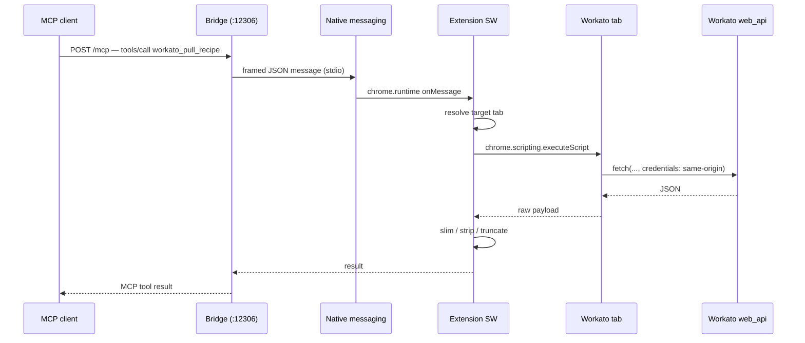

# Architecture

How a tool call travels from an MCP client to Workato and back.

## Components

| Component            | Package                                           | Role                                                                                                                                  |
| -------------------- | ------------------------------------------------- | ------------------------------------------------------------------------------------------------------------------------------------- |
| **Local bridge**     | `app/native-server` → npm `workatomcp-bridge`     | Fastify server on `127.0.0.1:12306`. Terminates MCP transports, forwards tool calls to the extension, serves local file reads/writes. |
| **Chrome extension** | `app/chrome-extension` → npm-less, built with WXT | MV3 service worker. Owns every tool handler, resolves the Workato tab, executes in-tab fetches, slims responses.                      |
| **Shared schemas**   | `packages/shared` → npm `workatomcp-shared`       | `TOOL_NAMES` and `TOOL_SCHEMAS` — one source of truth consumed by both sides.                                                         |
| **Recipe skill**     | `skills/workato-recipes`                          | Documentation-only companion for recipe authoring. Not part of the runtime.                                                           |

## Request lifecycle


```mermaid
sequenceDiagram
    participant C as MCP client
    participant B as Bridge (:12306)
    participant N as Native messaging
    participant E as Extension SW
    participant T as Workato tab
    participant W as Workato web_api

    C->>B: POST /mcp — tools/call workato_pull_recipe
    B->>N: framed JSON message (stdio)
    N->>E: chrome.runtime onMessage
    E->>E: resolve target tab
    E->>T: chrome.scripting.executeScript
    T->>W: fetch(..., credentials: same-origin)
    W-->>T: JSON
    T-->>E: raw payload
    E->>E: slim / strip / truncate
    E-->>B: result
    B-->>C: MCP tool result
```

1. **Transport.** The bridge exposes streamable HTTP at `POST/GET/DELETE /mcp`, legacy SSE at `GET /sse` + `POST /messages`, and a stdio binary (`workatomcp-stdio`) for clients that require a spawned process. `GET /ping` is a liveness check.
2. **Bootstrap.** The bridge is not started by hand. Chrome launches it through native messaging when the extension first needs it; the extension tells the host which port to listen on.
3. **Dispatch.** The native-messaging host frames requests over stdio (4-byte little-endian length prefix, 16 MB cap) and correlates responses by UUID.
4. **Execution.** Every Workato tool runs _inside a Workato tab_ via `chrome.scripting.executeScript`, so requests carry the session cookies and the CSRF token read from the `XSRF-TOKEN-V2` cookie. No credentials ever cross a process boundary.
5. **Slimming.** Handlers reshape Workato's verbose payloads before returning: schema blocks removed, datapill references shortened, long values truncated, secret-shaped keys stripped. `full: true` opts out where it makes sense.

## Tab resolution

`findWorkatoTab()` in [`workato/tab-dispatch.ts`](../app/chrome-extension/entrypoints/background/tools/workato/tab-dispatch.ts) is the single gatekeeper. It resolves, in order:

1. An explicit `tabId` argument
2. The tab pinned by `workato_switch_profile`
3. A Workato tab in the requesting window
4. Any open Workato app tab

Deliberately **never** the focused tab: focus drift used to send Workato calls into unrelated pages. Hosts are matched against `*.workato.com` and `*.workato.is`, and non-app subdomains (docs, marketing, status) are ignored. Zero matches raise `TabNotFound`; two different app hosts raise `MultipleWorkatoHosts`. An explicit `tabId` that no longer resolves to a signed-in app tab throws rather than falling through to another tab, and `findWorkatoTab` takes an optional `windowId` so window-scoped resolution lives in the dispatcher rather than in one tool.

## Session context

A Workato call's identity is **profile plus tab**, because Workato resolves the workspace and the environment from the tab's own session. Nothing in a response used to say which one that was.

`session-context.ts` in the extension reads `/web_api/auth_user.json` and slims it to `{host, workspace_id, workspace_name, environment, user_id}`, cached per tab for 60 s and dropped on a URL change, a tab close or any read error. `workato_session_context` exposes it directly.

- **The context block.** Every successful `workato_*` result gets one extra text block, always LAST and under 200 bytes: `{"context":{tab_id, host, workspace_id, workspace_name, environment}}`, with the routed `profile` added by the bridge. Producing it can never fail a call. Every response parser in the bridge reads the FIRST block, so orchestrators are unaffected.
- **The pinned tuple.** `createToolRouter` holds one `SessionContext` (profile, tabId, host, workspace_id, workspace_name, environment, pinned_at, registry generation). `workato_switch_profile` with a `tabId` probes that tab once and pins the whole tuple; every later call, top-level and nested, carries the pinned tab and an `expected_context`.
- **Verification.** Write entry points call `assertExpectedContext` before acting and throw `ContextMismatch`, naming expected and actual. `ProfileRegistry` bumps a generation counter on connect and disconnect; when it moves, the pinned tab is re-read once and the call is refused with `ContextChanged` if the workspace or environment differ.
- **On disk.** `workato_pull_recipe(out_file)` writes an `origin` block into the envelope (pulled_at, profile, tab, host, workspace id and name, environment, folder). The save path turns it back into an expected context and defaults `expected_base_version_no` from the file's `version_no`. `ignore_file_version` and `allow_context_mismatch` are the deliberate overrides, consumed in the bridge and never forwarded to the extension.

## The guarded mutation engine

Every native recipe write runs through one module, `app/native-server/src/mcp/workato-recipe-engine.ts`, in this order:

1. Pull once, `view: "full"`, forwarding `tabId` / `windowId`.
2. Refuse a stale caller-supplied `expected_base_version_no` before any operation runs; otherwise default it to the pulled `version_no`.
3. Deep-clone the tree and apply every operation to the CLONE.
4. Renumber the whole tree when structure changed.
5. Derive extended schemas over the whole tree (`workato-recipe-schema.ts`) unless `auto_schema: false`.
6. Validate locally: numbering, `as` format and uniqueness, `uuid` presence, block ordering, `foreach` source placement, datapill references.
7. MERGE the pulled `config` rather than rebuilding it, so `account_id` and `skip_validation` survive and only a new provider is appended.
8. Save once through `workato_ui_save_recipe_code`, then summarize once with `persisted` / `valid` / `verified`, `changed_paths` and `version_no`.

`workato_recipe_apply` batches up to 50 operations through the same path. `workato_recipe_validate` reuses steps 1 to 6 and stops there; it never calls the save tool, which a test asserts.

**Where the legacy names live now.** `workato_recipe_add_step`, `workato_recipe_set_step_input` and `workato_recipe_map_datapill` were extension tools with their own CDP implementation. They are now thin wrappers over the engine's ops, routed in the bridge through `WORKATO_RECIPE_MUTATOR_TOOLS`, and `app/chrome-extension/entrypoints/background/tools/workato-recipe/` is deleted. There is one implementation rather than two that drift, and **the bridge and the extension must ship together** for this reason.

## The operations journal

`app/native-server/src/mcp/workato-operations.ts` makes `workato_recipe_save_with_dependents` survive a client timeout or a bridge restart.

- **Location.** One JSON file per operation in the bridge state directory (`%LOCALAPPDATA%\mcp-chrome-bridge\operations` on Windows), with an `os.tmpdir()` fallback and `WORKATOMCP_OPERATIONS_DIR` for tests. Atomic tmp plus rename writes, pruned once per process at 200 files or 7 days.
- **Contents.** `operation_id`, `kind`, timestamps, context, the args WITHOUT the code tree (a `code_path` plus a sha256 prefix), every affected recipe with the running state and version it had BEFORE the operation, phases with timestamps and results, and an `interrupted` marker.
- **Phases.** The phase is written BEFORE the call it describes, so an interrupted call still leaves a trace. A process `exit` hook marks any still-running operation interrupted synchronously.
- **Resume.** `workato_operation_status` is bridge-local: the read path makes no extension call at all. `resume: true` re-reads every affected recipe, restarts only what was running before and only when the saved version is usable and connections are healthy, re-issues an unknown save under the journalled version lock (so Workato answers `already_applied`), and names exact ids and reasons for anything it will not finish. Nothing is restored blindly on a transport that just failed.

## The snapshot cache

A recipe read is two requests, and they used to be able to straddle a save. `pull-recipe.ts` fetches metadata first and then pins the code to that exact version (`code.json?mode=view&version_no=<n>`), and caches the pair in the service worker keyed by **tab host plus recipe plus version**, bounded at 32 entries and 20 MB.

A key that does not match the current version simply cannot be served, so a stale entry is structurally impossible; every extension write path also calls `invalidateRecipeSnapshot` so the memory is freed promptly. `loadRecipeSnapshot(tab, recipeId, {timeoutMs, ifVersion})` is how another tool reads a recipe without a second fetch: `workato_list_jobs` (report labels), `workato_test_recipe` and `workato_recipe_callers` all go through it.

## Auto-file post-processing

`app/native-server/src/mcp/workato-auto-file.ts` gives the read surface one escape hatch instead of a per-tool one.

- **Served-schema injection.** `withOutFileToolSchemas` adds `out_file`, `auto_file` and `auto_file_threshold_chars` to every tool in `AUTO_FILE_SCHEMA_TOOLS` at `listTools` time, filling in only a property the tool does not already declare. Nothing changes in `tools.ts`; adding a read tool to the set is one line in `READ_TOOLS`.
- **Prepare, then apply.** `prepareAutoFileCall` extracts and strips the three arguments before the browser round trip (so a bad path fails early) and returns early for the four tools that own their own `out_file` hook: `workato_pull_recipe`, `workato_lcap_page_get`, `workato_api_request`, `workato_adapter_meta`. `applyAutoFile` runs at the single success return, writing the full text or the decoded image bytes with a tmp plus rename write and returning a summary: `saved_to`, `bytes`, `content_type`, `version_no`, top-level keys, depth-1 array counts, and the payload's own truncation flags copied verbatim.
- **Not hooked.** The nested `callExtension` inside the orchestrators is deliberately left alone: spilling an orchestrator's own pull would hand it a summary instead of the payload. Bridge-local tools (`workato_recipe_apply`, `workato_recipe_validate`, `workato_operation_status`, `workato_datapill`, `workato_bridge_info`) return before the post-processor and take none of these properties.

## Multi-profile support

Chrome runs one extension instance per profile, and each connects to the bridge over `GET /ws-client` carrying its profile name. `ProfileRegistry` keeps the socket map and the currently active profile; `workato_list_profiles` enumerates it, `workato_switch_profile` selects one for the rest of the session and can pin a specific tab id at the same time.

This is what makes a single MCP client able to work across, say, a customer sandbox in one profile and production in another.

## File round-trip

Large payloads bypass the model's context entirely. The bridge exposes local file read/write to the extension, so:

- `workato_pull_recipe(out_file: "recipe.json")` writes the code tree to disk and returns a path plus summary.
- `workato_ui_save_recipe_code(code_path: "recipe.json")` reads it back and PUTs it.
- `workato_recipe_set_py_eval_code(code_path: "parser.py")` splices a Python file into a step.
- `workato_lookup_table_import_csv(csv_path: "rows.csv")` streams a CSV into a multipart upload.

Recipes above roughly 50 KB should always use this path.

## Timeouts, retries, and write verification

| Layer              | Limit                                                                 |
| ------------------ | --------------------------------------------------------------------- |
| MCP client         | typically cuts off around 60 s                                        |
| Bridge → extension | 120 s ceiling                                                         |
| Tool default       | 30 s (40 s for version diffs), configurable 10–110 s via `timeout_ms` |

Reads retry once automatically on a 30 s timeout and report `retried: true`; long-running calls such as `run_query` are excluded so the bridge ceiling isn't blown. Paginating reads (`list_jobs`) budget their page walk from `timeout_ms` and return partial results with `partial: true`, `scanned_through`, and `next_cursor` rather than dying mid-walk.

**Writes are never blindly retried.** A timed-out write verifies itself instead: stop/start re-read the recipe state, `set_version_comment` re-reads the versions list, `save_recipe_code` compares `version_no`. The result is reported as `save_status: "succeeded_after_timeout"` instead of a false failure.

Recipe saves accept `expected_base_version_no` for optimistic locking, so a concurrent edit fails loudly rather than being silently overwritten.

## Code layout

```text
app/chrome-extension/entrypoints/background/
├── native-host.ts                 # bridge message listener
└── tools/
    ├── workato/                   # recipes, jobs, connections, callers, folders, dispatch,
    │                              #   CSRF, session context, snapshot cache, slimming
    ├── workato-ui/                # live editor automation + save_recipe_code
    ├── workato-lookup/            # lookup tables
    ├── workato-data-table/        # data tables
    ├── workato-session/           # whoami
    └── browser/                   # inherited browser automation

app/native-server/src/
├── server/index.ts                # Fastify routes, MCP transports
├── server/profile-registry.ts     # per-profile WebSocket connections, generation counter
├── native-messaging-host.ts       # stdio framing to/from Chrome
├── file-handler.ts                # local file reads/writes for the round-trip
└── mcp/                           # MCP server, stdio entrypoint, server identity,
                                  #   the recipe mutation engine and validator,
                                  #   caller discovery, the operations journal, auto-file
```

## Adding a tool

1. Declare it in `packages/shared/src/tools.ts` — a `TOOL_NAMES` entry and a `TOOL_SCHEMAS` definition. Descriptions matter: they are the agent's only documentation at call time, so state the prerequisites, the gotchas, and what the response looks like.
2. Implement the handler in the matching `tools/workato*` directory and export it from that directory's `index.ts`.
3. `pnpm build:shared && pnpm build:extension`, reload the unpacked extension, restart the MCP client so the new schema is fetched.

Two constraints worth knowing before writing in-tab code:

- **In-page functions must be plain, bundler-safe JavaScript.** `chrome.scripting.executeScript` serializes the function, so use `function () { ... .then(...) }` rather than `async`/`await`, which the bundler rewrites into helpers that don't survive serialization.
- **Read the CSRF token from the `XSRF-TOKEN-V2` cookie**, not from a `<meta>` tag — editor pages don't have one.

## Origin

WorkatoMCP started as a fork of [hangwin/mcp-chrome](https://github.com/hangwin/mcp-chrome) and keeps its extension shell, native-messaging bridge, MCP transport handling, and browser-automation tools. It is developed independently and does not track upstream changes. On top of that base it adds the Workato tool families, tab resolution and session model, the multi-profile registry, the file round-trip, write verification and the safety gates, and publishes its own packages, `workatomcp-bridge` and `workatomcp-shared`.

Historical design specs and implementation plans live in [`docs/design/`](design/).
